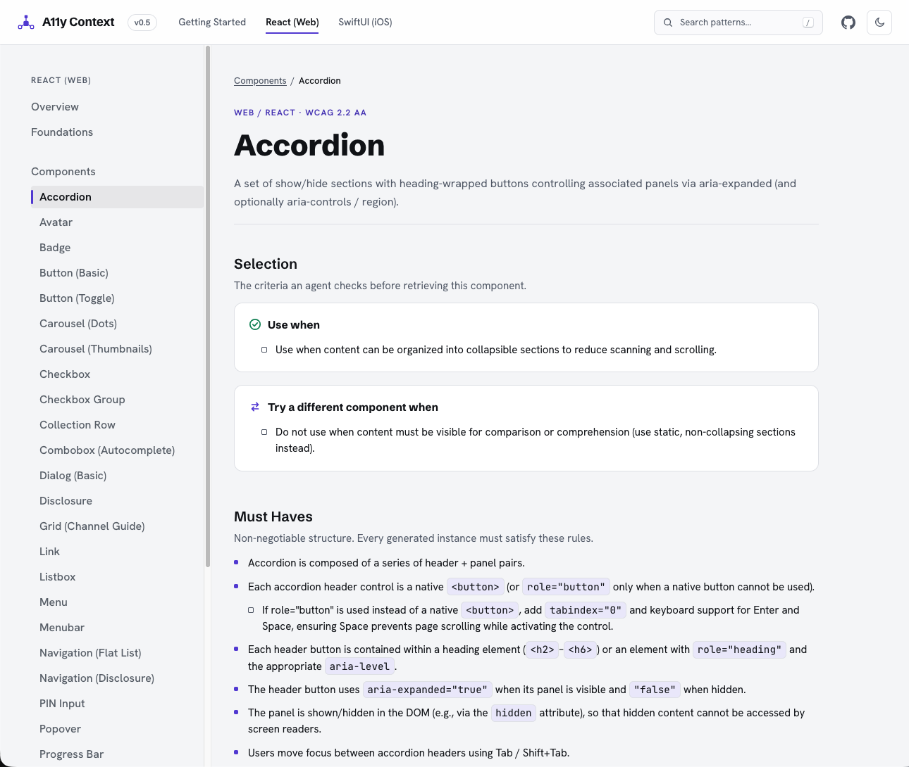

# A11y Context

[](LICENSE)

A structured corpus of production-ready accessibility patterns, written to be retrieved by AI coding agents at the moment they generate code. Every pattern carries prescriptive Must Haves, a golden implementation, and acceptance checks, so an agent can apply it without the developer knowing the underlying rules.

Microsoft found that AI-generated UI passes accessibility checks roughly 12% of the time. This corpus exists to change that upstream, at authoring time, rather than catching it in an audit months later.

**Live site: [a11y-context-project.vercel.app](https://a11y-context-project.vercel.app)**

<picture>
  <source media="(prefers-color-scheme: dark)" srcset="docs/pattern-page-dark.png">
  <source media="(prefers-color-scheme: light)" srcset="docs/pattern-page-light.png">
  
</picture>

## What's in it

| Stack | Status | Count |
|---|---|---|
| Web / React | Published | 23 patterns + Foundations |
| iOS / SwiftUI | Published | 13 patterns + Foundations |
| Android / Compose | Taxonomy only | — |

Patterns are consumed three ways: bundled with the [skill](https://github.com/a11y-context/a11y-context-skills), fetched over HTTP from the live site, or retrieved through the [MCP server](https://github.com/a11y-context/accessibility-pattern-mcp). The selection logic lives in the skill; only the retrieval step changes.

---

## Repository structure

```
/patterns                    ← source of truth for all content
  /web/react                 ← Web / React corpus (published)
    catalog-meta.json        ← hand-edited top-level catalog metadata
    patterns.json            ← generated catalog (see "patterns.json is generated" below)
    component-gallery.md     ← generated table of patterns
    /components              ← one .md file per component pattern
    /global                  ← cross-cutting rules (Foundations)
  /ios/swiftui               ← iOS / SwiftUI corpus (published, same layout)
  /android                   ← Android Compose (taxonomy only, no patterns yet)

/schema
  pattern-template.md        ← canonical pattern format
  style-guide.md             ← canonical authoring conventions

/website                     ← Docusaurus site (sourced from /patterns)
  scripts/                   ← prebuild generators
  docusaurus.config.js
  ...

CLAUDE.md                    ← operating instructions for Claude sessions in this repo
CONTRIBUTING.md              ← license, scope, versioning, first-contribution walkthrough
```

---

## `patterns.json` is generated

Each pattern's `.md` file (frontmatter + `## Use When` / `## Do Not Use When` body bullets) is the single source of truth. `patterns.json` is regenerated by `website/scripts/generate-patterns-json.js` during `npm run prebuild` and committed so the MCP server and other consumers can read it without running the build. **Do not hand-edit `patterns.json`** — author the `.md` only.

Top-level catalog metadata (`catalog_revision`, `schema_version`, etc.) lives in `patterns/web/react/catalog-meta.json`. Bump that on every release.

## Adding or revising a pattern

See [`CONTRIBUTING.md`](./CONTRIBUTING.md) § "Your first contribution — walkthrough" for the full path. The short version: open an issue → branch → edit the `.md` → bump versions → run `npm run prebuild` → open PR. CI verifies the build and that `patterns.json` is in sync with the `.md` sources.

---

## Previewing your changes locally

To see your pattern edits render against the docs site:

```bash
cd website
npm install        # first time only
npm start          # http://localhost:3000
```

Node ≥ 18 required.

You don't need to build the production site yourself — CI runs the production build on every PR. The canonical site lives at the URL above.

---

## Related repositories

- [a11y-context/a11y-context-skills](https://github.com/a11y-context/a11y-context-skills) — installable AI coding assistant skills derived from this corpus (downstream; auto-synced by CI on every push to `main`).

## License

Apache 2.0 — see [LICENSE](./LICENSE).
