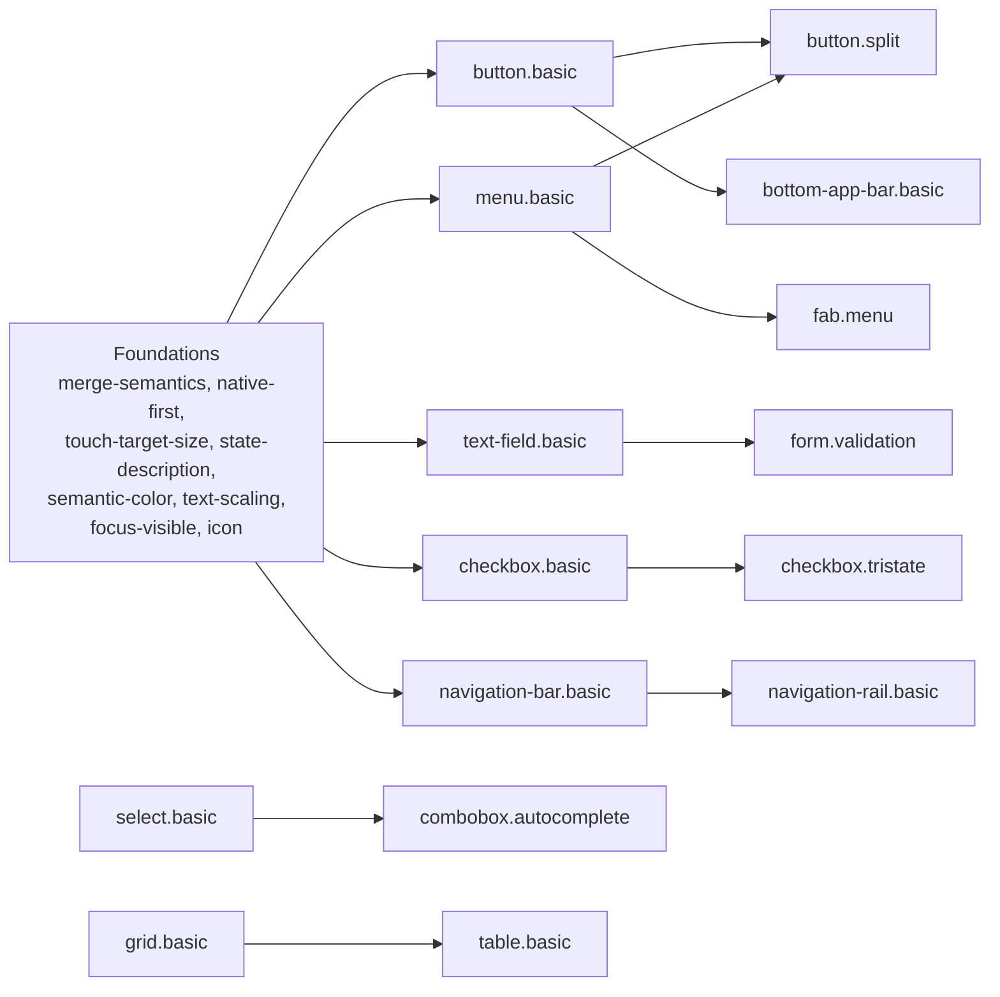

# Android / Jetpack Compose Component Taxonomy

The planned component set for the Android/Compose corpus: the full list of component patterns, the Foundations (`global.*`) rules, the naming convention, the platform traps, and where each accessibility technique lands. **Read this before authoring or proposing an Android/Compose pattern** so families and names stay consistent.

Informed by the CVS Health Android Compose Accessibility Techniques project (Apache-2.0). Techniques are re-expressed in original prose per this corpus's style guide; nothing is copied verbatim.

Every API claim below was verified against live documentation on 2026-09-17. Claims that could not be confirmed are marked **unverified** and must be checked before they reach a Must Have.

## Scope

Android mobile: phone and tablet. Compose for TV is a separate future stack value, `android/compose-tv`, and is not built here. Media components (player, captions, cast, program guide) are out of scope for this wave.

Baseline is `androidx.compose.material3` 1.4.0. Golden Patterns are written against Material 3 composables, because Material components carry correct roles, states, and minimum touch targets by default and Foundation primitives carry none of them. Foundation primitives are named only where Material supplies a requirement for free and Foundation does not.

The corpus serves any Android app, not one product. Paramount's apps inform which patterns are authored first; they never decide which patterns exist.

## The unit of a pattern

Read this before deciding whether a component deserves a file, because it is the question Android answers differently from web.

The web corpus exists because the web ships no native anything. You assemble a dialog from divs, so the pattern's job is telling you what to assemble. Compose ships a correct `AlertDialog`. That changes what a pattern says, not whether it is needed, because Material's guarantee has a boundary and nothing ships that boundary for you.

**A pattern's unit is the smallest thing with a complete accessibility contract. On Android that is almost never one composable.** It is `Checkbox` plus its label plus the row that owns `toggleable`. It is `TextField` plus its label, supporting-text, and error slots. It is `RadioButton` plus `selectableGroup()` plus the items. Material gets the composable right. The contract lives one level up.

Three jobs follow, and every Android pattern does some mix of them:

1. **Enforce the native choice.** The common failure is not that `Checkbox` is broken; it is an agent building a checkbox from `Row` plus `Icon` plus `clickable` because that is what the layout looked like. Cheap to state, highest frequency.
2. **Fix the composition around the correct component.** Where the real bugs live. `Checkbox` applies its 48dp target only when it owns the click handler, so lifting state to a parent `toggleable`, which is Material's own documented pattern, silently removes it. Nobody customized anything and the guarantee broke anyway. The same class covers wrong-slot errors: a label passed to `placeholder`, an error in `supportingText` without `isError`.
3. **Specify what Material does not ship.** Stepper, PIN input, accordion, listbox.

Two consequences. Android patterns run roughly a third the length of their web siblings, because the mechanics are already handled. And a component with no composition hazard needs no pattern, though testing that against the real list, such components are rarer than they sound.

**The web sibling is the conceptual guide.** Interaction expectations are parallel across stacks even where the mechanism is not, so each Android pattern is authored against its web counterpart's behavior contract, then written in Compose terms. That also avoids re-deciding boundaries the web corpus already settled.

## Naming convention

- **`family.variant`**, lowercase ASCII, dot-separated. Multiword segments use kebab-case (`text-field`, `bottom-sheet`). The default variant is `.basic`.
- **The family follows the name an Android engineer would search for**, which is Material 3's name where Material has one and it is unambiguous. This differs from the iOS taxonomy, which derives the family from the cross-stack accessibility semantic. The divergence is deliberate: on iOS the framework name and the accessibility semantic disagreed only rarely, while on Android the Material name is both the thing engineers type and, in three cases, the thing that prevents a dangerous collision.
- **Where Material's single name covers several accessibility contracts, the family splits and the variant carries the distinction.** One Material name never becomes one pattern by default.
- **Where Material's name would be actively misleading, the industry name wins over Material's.** Only one case: Material has no name for the select control beyond the composable `ExposedDropdownMenuBox`, so `select.basic` keeps the industry name.
- **The cross-stack equivalence lives in `aliases`, not the ID.** `divider.basic` carries `separator` so a developer or agent arriving from the web corpus still lands on it.
- **Many CVS techniques are behaviors, not components.** Those become `global.*` Foundations rules that components reference rather than restate.

## Confirmed traps and platform gotchas

Verified, not recalled. Every item here is something a model will confidently produce wrongly, and several are APIs that do not exist.

**Fabrications. These names are plausible and wrong.**

- **`AccessibilityManager.isReduceMotionEnabled()` does not exist** and never has. It is absent from the current `AccessibilityManager` reference. The real mechanism is the system "Remove animations" toggle setting `Settings.Global.ANIMATOR_DURATION_SCALE` to 0, which Compose's animation APIs read through the `MotionDurationScale` coroutine-context key.
- **There is no `.accessibilityRepresentation` equivalent.** Compose has no API for exposing a hidden native control behind a custom-drawn one. It offers the individual semantics properties and actions, and the developer assembles them.
- **There is no `.accessibilityHint` equivalent.** Nothing carries open-ended supplementary guidance. `onClickLabel` covers the primary action's description only, phrased as a completion of "Double tap to ___".
- **There is no custom-rotor equivalent.** TalkBack's reading controls are a fixed, system-defined category list inferred from semantics. No API adds a category.
- **There is no `@ScaledMetric` equivalent.** No API rescales a `dp` value by the font-scale factor.

**Deprecations and version facts.**

- **`announceForAccessibility` and `TYPE_ANNOUNCEMENT` events are deprecated as of Android 16 (API 36).** The replacement is split by category: `liveRegion` for critical content changes, `paneTitle` for window and pane changes, `error()` for validation errors. Choosing the wrong category is the mistake the Foundations rule exists to prevent.
- **`Role` has exactly nine members**: `Button`, `Checkbox`, `Switch`, `RadioButton`, `Tab`, `Image`, `DropdownList` (1.4.0), `Carousel` (1.8.0), `ValuePicker` (1.8.0). It is a closed set far smaller than `UIAccessibilityTraits`. A component whose role is not a member cannot claim one, and the semantics have to be carried by other properties.
- **`hideFromAccessibility()` is the current API**, succeeding the deprecated `invisibleToUser()`.

**Behavioral surprises in the semantics tree.**

- **`clickable` and `toggleable` set `mergeDescendants = true` internally.** A `Row` of icon plus text becomes one TalkBack stop the moment the row is made clickable.
- **A clickable child inside a clickable parent is not absorbed by the parent's merge**, because a parent cannot merge children that merge themselves. The nested control survives as its own node, so the failure is two competing targets rather than one lost control. Both are wrong; they are wrong differently.
- **`clearAndSetSemantics` clears everything applied after it in the modifier chain.** Modifier order determines what survives.
- **`minimumInteractiveComponentSize()` must be placed before any size-constraining modifier** or it has no effect.
- **`traversalIndex` has no effect** unless the node is focusable or its container sets `isTraversalGroup`.
- **Lazy layouts apply list semantics automatically but do not populate `CollectionInfo` or `CollectionItemInfo`.** Position and total count are set by hand.
- **Material selection controls apply the 48dp minimum only when they own the click handler.** Lift state to a parent `toggleable` or `selectable`, which is Material's own documented pattern for a settings row, and the control renders with no padding while the parent becomes responsible for the target.
- **`testTag` is invisible to accessibility services** unless an ancestor sets `testTagsAsResourceId`.
- **Focus is two systems, not one.** `FocusRequester` moves keyboard and D-pad focus; `Modifier.semantics { focused = true }` moves the TalkBack cursor. iOS's `@AccessibilityFocusState` unifies both. Android does not.

**Vocabulary collisions specific to this platform.**

- **`android.widget.Toast` is a real platform API and is not Material's Snackbar.** Naming a Snackbar pattern `toast.*` would point an agent at the wrong API.
- **"Spinner" on Android means a select control**, from the legacy `Spinner` widget. It does not mean a loading indicator.

## Settled boundaries

The contested calls, resolved. Each was surveyed against four or more design systems; the survey table is near the end of this document.

**Snackbar is its own family, not `toast.*`.** Material, Acorn, and Fluent UI Android all ship "Snackbar," and the platform's own `android.widget.Toast` is a different construct that Material's guidance explicitly routes away from. The web corpus's `toast.*` family carries `snackbar` as an alias; Android inverts it. This is the one case where a name collision, not a preference, forces the family apart.

**Snackbar splits on whether it carries an action**, mirroring the web `toast.basic` and `toast.action` split. Material exposes the action as a slot on one composable, which argued for one pattern, but the accessibility contract disagrees: a message the user may need to act on, that focus never moves to, is a different problem from one that only reports. The reachability caveat is the pattern, so it gets its own file.

**Divider, not separator.** All four native-Android sources say Divider. "Separator" appears only in Fluent Web.

**Progress indicator splits on determinacy.** The web corpus split `progress-bar` from `spinner` on a different axis, whether the indicator carries its own name or sits inside a control that already has one. Android splits on determinacy instead, because the Compose overloads differ: one takes a `progress` value and populates `ProgressBarRangeInfo`, one does not and announces activity with no value. Two composables' worth of contract. The web axis becomes a branch inside each. "Spinner" is unavailable as a name regardless, because on Android it means a select control.

**Bottom sheet is its own family, distinct from both dialog and navigation drawer.** Material, Fluent UI Android, Acorn, and Backpack Android each ship it separately. Several web systems fold it into Drawer, which is the precedent to avoid. Modal and standard are accessibility-distinct: the modal sheet traps focus and adds a scrim, the standard sheet leaves background content reachable.

**Navigation splits three ways**, following Material and Acorn: `navigation-bar` (bottom tabs), `navigation-rail` (side, persistent), `navigation-drawer` (side, overlay or persistent). The web corpus's single `navigation-menu` family does not survive contact with Android's component model.

**Button absorbs the icon-only, floating, and action-chip cases.** `IconButton`, `FloatingActionButton`, `AssistChip`, and `SuggestionChip` are all `Role.Button` with no state of their own. What differs between them is where the accessible name comes from and where the control sits in traversal order, which is two Must Have branches rather than four files. Material's own chip spec concedes the button overlap, and Adobe Spectrum classifies its equivalent as a button variant outright. The alternative names ride in `aliases` so retrieval still lands.

**Chips reduce to two patterns, both about state.** `chip.filter` carries `selected` and exposes toggle semantics. `chip.input` carries `selected` plus a trailing remove affordance, which puts a second interactive target inside one visual chip and is the merge-semantics trap in miniature. Material is the only surveyed system naming four chip types; every other ships one Chip or Tag with variant props.

**`chip.*` is a new family and it is not `badge.*`.** The corpus splits badge from tag on interactivity: a badge is not focusable and has no keyboard contract, while the thing `tag.basic` was reserved for can be selected or dismissed. Every Material chip is interactive, so chips occupy the territory reserved for `tag.basic`. **This is a cross-stack decision and is flagged for John rather than settled here.**

**List item, not list row.** Material ships a literal `ListItem` composable. The iOS family is `list.row`, named for a `NavigationLink` inside a `List`, which is not what Android's primitive is.

**Segmented button, not segmented control.** Material's name, and the industry splits evenly with no Android-side precedent for "control." Single-choice and multi-choice rows are accessibility-distinct: one composes items with radio semantics, the other with checkbox semantics.

**Select keeps its industry name.** Material has no component-level name for the select control, only the composable `ExposedDropdownMenuBox`. Fluent UI Android says ComboBox, Backpack says Spinner, which on Android means something else again. `select.basic` carries `ExposedDropdownMenu` and `exposed dropdown` in aliases. The one place where leaning toward the framework name would produce a worse ID than the industry one.

**Menu and select are different families**, matching the iOS taxonomy's value-against-command distinction. `menu.basic` is `DropdownMenu`, a list of commands. `select.basic` is a value chooser.

**Text field absorbs the secure case.** Material now ships `SecureTextField` separately, but the contract difference is an obscured value plus an optional show-and-hide toggle, which is one Must Have branch. iOS folded `SecureField` the same way.

## Components

Legend: **W1 / W2 / W3** = the wave that authors it · **deferred** = later, with the reason, never a soft cut · **blocked** = cannot be authored yet, with what unblocks it · **cut** = will not be authored, with why · **folded** = absorbed by another pattern.

A deferred component is queued work. The iOS wave's failure was not that work stopped but that stopping left no record of which unwritten patterns were rejected and which were merely next, so every row below states which it is.

### Actions

| ID | Compose | What it is | Status |
|---|---|---|---|
| `button.basic` | `Button` and its four skins, `IconButton`, `FloatingActionButton`, `ExtendedFloatingActionButton`, `AssistChip`, `SuggestionChip` | Any in-place action. Branches on where the name comes from (visible text, `contentDescription`, or a label that disappears when an extended FAB collapses) and on placement outside the content flow | **W1** |
| `button.toggle` | `IconToggleButton`, `ToggleButton` | In-context on or off state. Distinct from `button.basic`: adds checked state | W2 |
| `chip.filter` | `FilterChip` | Selectable filter carrying `selected` | W2 |
| `chip.input` | `InputChip` | Selectable token with a remove affordance. Two interactive targets in one chip | W2 |
| `button.split` | `SplitButtonLayout` | Leading action plus trailing menu trigger | deferred to W2; composes `button.basic` and `menu.basic`, both W1 |
| `fab.menu` | `FloatingActionButtonMenu` | Expandable menu of actions | deferred to W3; adds disclosure semantics, wants `menu.basic` merged first |
| `button.group` | `ButtonGroup` | Container arranging connected buttons | cut: layout only, no role or state of its own |

### Links

| ID | Compose | What it is | Status |
|---|---|---|---|
| `link.standalone` | `Modifier.clickable` on text, or `TextButton` | A link outside a text block. Android has no Link composable, so purpose clarity, target size, and focus visibility all have to be stated | **W1** |
| `link.inline` | `buildAnnotatedString` with `LinkAnnotation.Url` | A link inside a paragraph, which TalkBack surfaces through its Links list | **W1** |

### Navigation and rows

| ID | Compose | What it is | Status |
|---|---|---|---|
| `list-item.basic` | `ListItem` | A row in a vertical list, with leading, trailing, overline, and supporting slots. Merges its descendants by default, so a row carrying several controls is the platform's sharpest merge hazard | **W1** |
| `navigation-bar.basic` | `NavigationBar`, `NavigationBarItem` | Bottom navigation between top-level destinations. Announces as Tab | **W1** |
| `tabs.basic` | `Tab`, `TabRow`, `ScrollableTabRow`, `PrimaryTabRow`, `SecondaryTabRow` | Switch between views. Primary against secondary and fixed against scrollable are visual | **W1** |
| `menu.basic` | `DropdownMenu`, `DropdownMenuItem` | Pull-down list of commands | **W1** |
| `navigation-drawer.modal` | `ModalNavigationDrawer`, `ModalDrawerSheet` | Temporary overlay navigation with a scrim and a focus trap | W2 |
| `navigation-drawer.persistent` | `PermanentNavigationDrawer`, `DismissibleNavigationDrawer` | Navigation alongside content, no focus trap. **Unverified** whether Dismissible and Permanent differ in exposed semantics beyond togglability | W3 |
| `navigation-rail.basic` | `NavigationRail`, `WideNavigationRail` | Side navigation on wider layouts | deferred to W3; same selection contract as `navigation-bar.basic`, so it references that pattern rather than restating it |
| `top-app-bar.basic` | `TopAppBar` and its three size variants | The screen's title bar and action slots. All four sizes are accessibility-identical | W2 |
| `bottom-app-bar.basic` | `BottomAppBar` | Bottom action bar | deferred to W2; composes `button.basic`, which is W1 |

### Text input and forms

| ID | Compose | What it is | Status |
|---|---|---|---|
| `text-field.basic` | `TextField`, `OutlinedTextField`, `SecureTextField` | Single-line text entry: label association, keyboard type, IME action, `error()` state, autofill `contentType`, and the obscured-value branch with its show-and-hide toggle | **W1** |
| `search-bar.basic` | `SearchBar`, `DockedSearchBar` | Search entry with an expanding results surface | **blocked**: the stable `SearchBar(state, inputField)` overload and every `Expanded*SearchBar` composable ship only in 1.5.0-alpha, not the 1.4.0 baseline. The remaining stable overloads are deprecated. Unblocks when 1.5.0 stabilizes |
| `select.basic` | `ExposedDropdownMenuBox` with a read-only `TextField` | Choose one value from a list | W2 |
| `form.validation` | `error()` semantics plus focus handling on submit | Form-level error handling | deferred to W2; redirects to `text-field.basic`, which is W1 |
| `pin-input.basic` | `BasicTextField` with `decorationBox` | Fixed-length code entry. No Material component exists | W2 |
| `combobox.autocomplete` | `ExposedDropdownMenuBox` with an editable `TextField` | Text entry with filtered suggestions | deferred to W3; depends on `select.basic` in W2, and CVS flags the editable case as materially harder |

### Selection

| ID | Compose | What it is | Status |
|---|---|---|---|
| `switch.basic` | `Switch` | Persistent on or off setting | **W1** |
| `checkbox.basic` | `Checkbox` | Independent binary choice | **W1** |
| `radio.basic` | `RadioButton` with `Modifier.selectableGroup()` | One from a mutually exclusive set. Android ships this natively, unlike iOS, so the pattern is about using it correctly rather than building one | **W1** |
| `checkbox.tristate` | `TriStateCheckbox` | Parent checkbox with an indeterminate state | deferred to W2; extends `checkbox.basic`, which is W1 |
| `segmented-button.single` | `SegmentedButton` in `SingleChoiceSegmentedButtonRow` | Mutually exclusive choice from two to five options. Radio semantics | W2 |
| `segmented-button.multi` | `SegmentedButton` in `MultiChoiceSegmentedButtonRow` | Independent multiple choice in the same chrome. Checkbox semantics | W2 |
| `date-picker.basic` | `DatePicker`, `DatePickerDialog` | Date selection | W3 |
| `date-picker.range` | `DateRangePicker` | Start and end date selection. **Unverified** how announced state differs per cell | W3 |
| `time-picker.dial` | `TimePicker` | Clock-face time entry, drag-driven | W3 |
| `time-picker.input` | `TimeInput` | Numeric time entry. A different interaction model, not a different skin | W3 |
| `listbox.basic` | `LazyColumn` with `selectable` items | Multi-select list. No Material component; built from primitives | W3 |

### Value adjusters

| ID | Compose | What it is | Status |
|---|---|---|---|
| `slider.basic` | `Slider` | Continuous or stepped value in a range | W2 |
| `stepper.basic` | Hand-built from `IconButton` plus `Text` | Discrete increment and decrement. Material ships no Stepper | deferred to W3; needs a naming decision first, because "Stepper" on Android often means a progress indicator |
| `slider.range` | `RangeSlider` | Two independently adjustable thumbs | **blocked**: CVS states plainly that `RangeSlider` keyboard accessibility is unsolved. Unblocks when Compose fixes it. Publishing a requirement nobody can meet is worse than publishing nothing |

### Overlays and feedback

| ID | Compose | What it is | Status |
|---|---|---|---|
| `dialog.alert` | `AlertDialog`, `BasicAlertDialog` | Modal message with actions. The two composables differ in how much layout Material supplies, not in semantics | **W1** |
| `bottom-sheet.modal` | `ModalBottomSheet` | Modal sheet with scrim and focus trap. Material already supplies more than expected: scrim tap and back press dismiss by default, `paneTitle` is set internally, and the drag handle is clickable and carries named expand, collapse, and dismiss accessibility actions. The pattern's work is the conditions under which those disappear, plus Escape, which is never handled | **W1** |
| `snackbar.basic` | `Snackbar`, `SnackbarHost` | Transient message announced through a live region, acknowledging something that already happened. No action to reach | **W1** |
| `snackbar.action` | `Snackbar` with an `action` slot | Transient message carrying an action. Focus never moves to the message, which is what keeps it from interrupting and what puts its action out of easy reach for sighted keyboard-only users. Splits from `snackbar.basic` for the same reason `toast.action` splits from `toast.basic` on web: the reachability contract is the whole pattern | **W1** |
| `progress-indicator.determinate` | `LinearProgressIndicator`, `CircularProgressIndicator` with a `progress` value | Measurable progress. Exposes `ProgressBarRangeInfo` and announces a percentage | **W1** |
| `progress-indicator.indeterminate` | The same composables with no `progress` argument | Activity with no known duration. No range info | **W1** |
| `tooltip.basic` | `TooltipBox` | Supplementary label on long-press or hover. Carries `@ExperimentalMaterial3Api` | W3 |
| `bottom-sheet.standard` | `BottomSheetScaffold` | Persistent sheet, no scrim, background stays reachable | **blocked**: carries `@ExperimentalMaterial3Api`. Unblocks on stabilization |
| `popover.basic` | `Popup` primitive | Anchored non-modal surface | cut: Material ships no Popover, and the concept is covered by `menu.basic`, `tooltip.basic`, and `bottom-sheet.*` |

### Containers, data, and media

| ID | Compose | What it is | Status |
|---|---|---|---|
| `image.basic` | `Image`, `Icon` | Decorative, informative, and functional roles as variants | **W1** |
| `content-shelf.basic` | `LazyRow` of image tiles | Horizontally scrolling collection of content tiles whose accessible name comes from data, not from rendered text. Lead aliases: `collection-row`, `shelf`, `rail`, `content row`, `carousel row` | **W1** |
| `card.basic` | `Card`, `ElevatedCard`, `OutlinedCard`, each with a clickable overload | Grouped surface, static or interactive. The clickable overload adds `Role.Button`; both branches are their own requirement | W2 |
| `badge.basic` | `Badge`, `BadgedBox` | Non-interactive indicator whose value folds into the host's name. **Unverified** whether a documented API suppresses standalone announcement | W2 |
| `divider.basic` | `HorizontalDivider`, `VerticalDivider` | Presentational separation | W3 |
| `accordion.basic` | Hand-built with `expand()` and `collapse()` semantics actions | Expand and collapse a section. Material ships no Accordion | W3 |
| `pull-to-refresh.basic` | `PullToRefreshBox` | Gesture-driven refresh. **Unverified** whether Compose supplies a non-gesture alternative; if not, that is the pattern's central requirement | W3 |
| `swipe-to-dismiss.basic` | `SwipeToDismissBox` | Gesture-driven dismissal, same non-gesture-alternative concern | W3 |
| `grid.basic` | `LazyVerticalGrid`, `LazyHorizontalGrid` | Two-dimensional collection | W3 |
| `carousel.basic` | `HorizontalMultiBrowseCarousel` and siblings | One item at a time in a rotatable sequence | **blocked**: the whole carousel sub-package carries `@ExperimentalMaterial3Api` |
| `table.basic` | Hand-built from lazy layouts | Data grid. Compose ships no table | deferred to W3; depends on `grid.basic` |
| `list.basic` | `LazyColumn` | Static list container | cut: its requirements are `global.collection-semantics` and `global.traversal-order` and nothing else |
| `text-editor.basic` | `TextField` with multiple lines | Multi-line text entry | cut: no contract distinct from `text-field.basic` on this platform |
| `disclosure.basic` | Hand-built | Generic show and hide | cut: on Android this is `accordion.basic`, and no surveyed native system draws the distinction |
| `avatar.basic` | `Image` with a shape | Identity representation | cut: Material ships no Avatar, and the requirements reduce to `global.image` plus `global.merge-semantics` |
| `splitter.basic` | None | Resizable panes | cut: no Material component, no native-Android precedent, not a mobile interaction |

## Foundations (`global.*` rules)

Referenced by components, not authored as component pages. Every rule passes the filter that a Foundations rule must be **executable at code-authoring time**: something the model can do while writing the code. Measurement, audits, on-device passes, and human judgment are verification and belong to the QA layer.

`scope` uses the shared vocabulary: `screen`, `layout`, `component`.

### The Android-specific disposition

| Rule | scope | Note |
|---|---|---|
| `global.native-first` | `[component]` | Reach for the Material component before composing one from primitives, because Material carries the role, the state exposure, and the minimum target and a hand-built equivalent carries none of them. States the general disposition once; each pattern states its own fallback conditions, since when you may not use `Checkbox` and when you may not use `AlertDialog` have different answers |

### Transfer with only the code examples changing

| Rule | scope | Note |
|---|---|---|
| `global.icon` | `[component]` | `contentDescription = null` for decorative, a real description for meaningful. Name what it does, not what it depicts |
| `global.focus-states` | `[component]` | Material components ship a themed focus indicator. A bare `Modifier.focusable()` composable gets only the ripple, which is near-invisible at rest, and must add an explicit treatment |

### Transfer with a changed contract

| Rule | scope | What changes |
|---|---|---|
| `global.touch-target-size` | `[component]` | 48dp target, 24dp floor per WCAG 2.2 AA 2.5.8. `minimumInteractiveComponentSize()` must precede size-constraining modifiers. The Android-only half: Material selection controls apply the minimum only when they own the click handler, so lifting state to a parent moves the obligation to the parent row |
| `global.semantic-color` | `[component]` | `MaterialTheme.colorScheme` roles over `Color(0xFF...)` literals. **Do not repeat the iOS claim that platform colors are pre-vetted for contrast.** The real guarantee is that roles are contrast-checked against each other inside the authored palette and switch light and dark automatically. Responding to the system "Increase contrast" setting is a separate opt-in integration through `UiModeManager.getContrast()` |
| `global.text-scaling` | `[layout, component]` | Renamed from `dynamic-type`, an Apple term. Size text in `sp`, never `dp`. Font scale reaches 200% and has been non-linear since Android 14, so `scaledDensity` is not a reliable scalar. Display size is a second independent axis. No `@ScaledMetric` substitute exists; read `LocalDensity.current.fontScale` where a non-text dimension must track type |
| `global.focus-not-obscured` | `[layout, component]` | Sticky chrome can hide a focused row. The mechanism is `BringIntoViewRequester` or `LazyListState.animateScrollToItem` |
| `global.motion` | `[component]` | Prefer Compose's built-in `animate*` APIs, which inherit the system animation scale through `MotionDurationScale` at no cost. Where a hand-rolled loop is unavoidable, read `Settings.Global.ANIMATOR_DURATION_SCALE` and stop at 0 |
| `global.use-of-color` | `[component]` | Stays its own rule rather than folding into `semantic-color`, diverging from iOS. Forced-colors is why the web corpus needs a separate `global.forced-colors`; it is not why `use-of-color` exists. That rule exists because color-alone fails for users with color vision deficiency on every platform, with no special rendering mode required. `semantic-color` governs which colors to use; this governs whether color is the only channel carrying the information. Different requirements, different failure modes |
| `global.headings` | `[layout]` | Mark major section headers with `heading()`. The web rule's document-outline substance does not transfer, but the requirement stands on a different footing: TalkBack's heading granularity is the only skip mechanism available and there is no API to add a category, so an unmarked header is unskippable content |

### Need original authoring, not translation

Four rules where the iOS Must Have cannot be restated because the platform primitive differs.

| Rule | scope | Why |
|---|---|---|
| `global.custom-control-semantics` | `[component]` | Renamed from `custom-control-representation`, because there is no representation API to name. The rule enumerates the semantics bundle each control archetype needs: role plus `stateDescription` plus a toggle action for a toggle-like control, role plus `progressBarRangeInfo` plus `setProgress` for an adjustable one. Compose supplies the pieces, not the assembly |
| `global.announcements` | `[component]` | A paradigm change, not a name swap. iOS fires one imperative call. Android's imperative path is deprecated as of Android 16, and the declarative replacement is split three ways: `liveRegion` for critical content, `paneTitle` for a window or pane appearing, `error()` for validation. The rule's job is choosing the right category |
| `global.screen-announcement` | `[screen]` | Replaces `navigation-focus`. On iOS `navigationTitle` names a screen and the system moves focus on push. On Android naming a surface and moving focus are unrelated concerns with no unified guarantee, so the rule states both separately |
| `global.focus-management` | `[layout, component]` | Designed around two focus systems where iOS has one: `FocusRequester` for keyboard and D-pad, `Modifier.semantics { focused = true }` for the TalkBack cursor. Restoring focus after a dialog closes means deciding which cursor is being restored |

### Android-only

| Rule | scope | Note |
|---|---|---|
| `global.merge-semantics` | `[component]` | Which modifiers and components merge by default, and the nested-clickable case where a child defies its parent's merge. No iOS or web analogue |
| `global.traversal-order` | `[layout]` | `isTraversalGroup` and `traversalIndex`, and the fact that `traversalIndex` does nothing on a non-focusable node without a traversal group above it |
| `global.collection-semantics` | `[component]` | `CollectionInfo` and `CollectionItemInfo`, and that lazy layouts announce "in a list" without populating position or count |
| `global.state-description` | `[component]` | `stateDescription` for discrete state, `progressBarRangeInfo` for a continuous range. SwiftUI's single `.accessibilityValue` covers both without forcing the choice |

### Excluded, with the reason

`global.text-contrast` and `global.non-text-contrast` are measurement; the executable residue folds into `global.semantic-color`, as it did on iOS. `global.sr-only` has no meaning in Compose, which sets the accessible name on the composable directly. `global.page-title` and `global.landmarks` have no Android counterpart. `global.forced-colors` has none either: the nearest analogue adjusts the app's own scheme if the app opts in rather than repainting author colors. `global.focus-states` folds into `global.focus-states`, since Android needs one focus-indicator rule and not two. Edge-to-edge insets are layout correctness rather than accessibility. Haptics on state change has no failure mode for an assistive-technology user. Autofill `contentType` belongs in `text-field.basic`.

`global.use-of-color` is **not** excluded; see the table above. The iOS corpus folded it into `semantic-color` and that is treated here as a defect to log rather than a precedent to match.

## Waves and dependencies

**Foundations ship before wave 1.** A component that inlines a rule has to be re-versioned when the rule is later extracted, so the seven rules wave 1 references land first: `global.native-first`, `global.merge-semantics`, `global.touch-target-size`, `global.state-description`, `global.semantic-color`, `global.text-scaling`, `global.focus-states`, plus `global.icon` for `image.basic`.

`global.merge-semantics` leads. It is the rule the largest number of Android patterns reference, and it has no counterpart in either existing stack, so there is no prior wording to lean on.

**Wave 1, nineteen patterns.** Ordering inside the wave puts the three that everything else redirects to first.

`button.basic`, `image.basic`, `list-item.basic`, then `content-shelf.basic`, `navigation-bar.basic`, `tabs.basic`, `menu.basic`, `dialog.alert`, `bottom-sheet.modal`, `snackbar.basic`, `snackbar.action`, `text-field.basic`, `checkbox.basic`, `switch.basic`, `radio.basic`, `link.standalone`, `link.inline`, `progress-indicator.determinate`, `progress-indicator.indeterminate`.

That is a large wave, and it is only tractable because Android patterns run roughly a third the length of their web siblings once Material handles the mechanics. Worth knowing at pattern one rather than discovering at pattern nine.

**Wave 2** picks up the components with no iOS sibling, which is the test of whether this taxonomy was authored rather than translated: `chip.filter`, `chip.input`, `card.basic`, `badge.basic`, `select.basic`, `slider.basic`, `button.toggle`, `segmented-button.single`, `segmented-button.multi`, `navigation-drawer.modal`, `top-app-bar.basic`, `pin-input.basic`, plus the four that unblock once wave 1 merges: `button.split`, `bottom-app-bar.basic`, `form.validation`, `checkbox.tristate`.

**Wave 3** is the long tail: `divider.basic`, `accordion.basic`, `grid.basic`, `table.basic`, `date-picker.basic`, `date-picker.range`, `time-picker.dial`, `time-picker.input`, `listbox.basic`, `tooltip.basic`, `pull-to-refresh.basic`, `swipe-to-dismiss.basic`, `navigation-rail.basic`, `navigation-drawer.persistent`, `fab.menu`, `combobox.autocomplete`, `stepper.basic`.

**Blocked, not scheduled.** Three patterns cannot be authored yet and each names what unblocks it: `slider.range` waits on Compose fixing `RangeSlider` keyboard accessibility, `bottom-sheet.standard` and `carousel.basic` wait on their APIs leaving `@ExperimentalMaterial3Api`.

### Dependency graph

Only the edges that actually constrain ordering. Everything not shown here is independent and can be authored in any order within its wave.

Read it as: eight edges, seven dependent patterns, and every one of them resolves by the end of wave 2. Nothing in wave 1 depends on anything else in wave 1, which is why the wave can be authored in any order once Foundations land.

## Authoring pipeline

Each pattern is authored on its own PR branch in a worktree off freshly fetched `origin/main`. New patterns are `status: beta` from the start; the unmerged branch isolates work in progress.

1. **Read the web sibling first.** Interaction expectations are parallel across stacks even where the mechanism is not, so the web pattern supplies the behavior contract and this corpus supplies the Compose mechanism. This also avoids re-deciding boundaries the web corpus already settled.
2. **AI drafts** from the CVS technique plus Android and Material documentation: Use When, Do Not Use When, Must Haves, Don'ts, Customizable, and a minimal Compose Golden Pattern. Annotates provenance and lists what a human must verify on device. Patterns carry no Acceptance Checks section; verification belongs to the QA layer.
3. **John reviews** on the rendered docs site, not as markdown.
4. **On-device pass** with TalkBack is the gate before merge. Only after it: bump `catalog_revision`, add release notes, merge.

There is no third enrichment step. WCAG criterion identifiers appear as plain text, sparingly, only where a requirement's justification is not obvious from the requirement itself. No hyperlinks in pattern files or `global_rules.md`.

Conform to `schema/style-guide.md` (the conventions) and `schema/pattern-template.md` (the format).

## Naming survey

What each system calls the thing, and why this taxonomy landed where it did. **[A]** marks a native-Android system; web systems are weaker evidence for an Android ID and are shown for cross-stack signal. Full per-system table with all 23 systems is in the research record; this is the decision summary.

Hyperlinks appear in this file and nowhere else in the corpus. `schema/` is contributor-facing: it is not copied by `scripts/sync-skills-repo.sh`, not rendered by the docs site, and not part of `patterns.json`, so no link here ever reaches a retrieving agent. Pattern files and `global_rules.md` stay link-free.

### Sources

Every URL verified 2026-09-17.

**Native Android**, the primary evidence for an Android ID:

| System | Component index |
|---|---|
| Material 3 (design) | https://m3.material.io/components |
| Material 3 (Compose API) | https://developer.android.com/reference/kotlin/androidx/compose/material3/package-summary |
| Microsoft Fluent UI Android | https://github.com/microsoft/fluentui-android/wiki/Controls |
| Mozilla Acorn (mobile) | https://acorn.firefox.com/latest/mobile/mobile-overview-N7sxQ6uE |
| Skyscanner Backpack Android | https://github.com/Skyscanner/backpack-android |

**Web**, cross-stack signal only:

| System | Component index |
|---|---|
| MUI | https://mui.com/material-ui/all-components/ |
| Angular Material | https://material.angular.io/components/categories |
| Shopify Polaris | https://polaris.shopify.com/components |
| IBM Carbon | https://carbondesignsystem.com/components/tag/usage/ (no working index URL; Tag is the page that matters here) |
| GitHub Primer | https://primer.style/components |
| Adobe Spectrum | https://spectrum.adobe.com/page/component-index/ |
| Microsoft Fluent 2 (web) | https://fluent2.microsoft.design/components/web/react |
| Atlassian | https://atlassian.design/components |
| Nord | https://nordhealth.design/components/ |
| GitLab Pajamas | https://design.gitlab.com/components/overview |
| Elastic EUI | https://eui.elastic.co/ |
| Ant Design | https://ant.design/components/overview/ |
| Base Web | https://baseweb.design/components/ |
| Chakra UI | https://chakra-ui.com/docs/components/concepts/overview |
| USWDS | https://designsystem.digital.gov/components/ |
| GOV.UK | https://design-system.service.gov.uk/components/ |
| Mantine | https://mantine.dev/core/package/ |
| shadcn/ui | https://ui.shadcn.com/docs/components |
| Bootstrap | https://getbootstrap.com/docs/5.3/components/ |

### Decisions

The Material 3 column links to the component's own spec page, which is the fastest way to check a naming call.

| Proposed ID | Material 3 [A] | Fluent Android [A] | Acorn [A] | Backpack [A] | Notable web names | Systems | Why this name |
|---|---|---|---|---|---|---|---|
| `button.basic` | [Button](https://m3.material.io/components/all-buttons), [IconButton](https://m3.material.io/components/icon-buttons), [FAB](https://m3.material.io/components/floating-action-button), AssistChip, SuggestionChip | Button | Buttons | Button | universal | 21 | Unanimous on the name. Absorbs icon-only, floating, and action-chip because all four are `Role.Button` with no state, differing only in name source and placement |
| `chip.filter` / `.input` | [FilterChip, InputChip](https://m3.material.io/components/chips) ([Compose](https://developer.android.com/develop/ui/compose/components/chip)) | not found | [Chips](https://acorn.firefox.com/latest/mobile/components/chips/android-ZX1gImzt) (undifferentiated) | not found | Chip, [Tag](https://carbondesignsystem.com/components/tag/usage/), Pill | 8 | Material is the only system naming four types; no other surveyed system replicates the split. Only the two state-bearing types earn patterns. Assist and Suggestion fold into `button.basic` |
| `snackbar.basic` | [Snackbar](https://m3.material.io/components/snackbar) | Notification, Snackbar | Snackbar | not found | Toast, Flag, MessageBar | 15 | Native Android says Snackbar. `toast.*` would collide with `android.widget.Toast` |
| `divider.basic` | [HorizontalDivider](https://m3.material.io/components/divider) | Divider | Divider | Divider | Divider, Separator, HR | 13 | Four for four on native Android |
| `list-item.basic` | [ListItem](https://m3.material.io/components/lists) | ListItem | not found | Bpk List Item | ListItem, ActionList.Item | 12 | Material's literal composable name |
| `bottom-sheet.modal` | [ModalBottomSheet](https://m3.material.io/components/bottom-sheets) | BottomSheet | [Bottom sheet](https://acorn.firefox.com/latest/mobile/components/bottom-sheet/android-fJIugWnu) | Sheet | Drawer, Tray, Offcanvas | 9 | All four native systems ship it separately from dialog and drawer |
| `navigation-drawer.*` | [ModalNavigationDrawer and siblings](https://m3.material.io/components/navigation-drawer) | Drawer | Site menu | not found | Drawer, Sidenav, Side Nav | 13 | Material's name; Acorn's "Site menu" is a Firefox-specific outlier |
| `navigation-bar.basic` | [NavigationBar](https://m3.material.io/components/navigation-bar) | Bottom Navigation | App bars | Bpk Nav Bar | no web equivalent | 14 | Material's name |
| `segmented-button.*` | [SegmentedButton](https://m3.material.io/components/segmented-buttons) | not found | not found | not found | Segmented Control, Content Switcher, Pivot | 11 | Material's name, as the only native-Android source with the component |
| `progress-indicator.determinate` / `.indeterminate` | [LinearProgressIndicator, CircularProgressIndicator](https://m3.material.io/components/progress-indicators) | ProgressBar, ProgressRing | not found | Bpk Progress, Bpk Spinner | ProgressBar, Spinner, Loading | 16 | Material has no Spinner, and "Spinner" means a select control on Android. Split on determinacy, which is the real accessibility axis |
| `select.basic` | [ExposedDropdownMenuBox](https://m3.material.io/components/menus) | ComboBox, Dropdown | not found | Bpk Spinner | Select, Picker, Combobox | 18 | The one case where the industry name beats Material's, because Material has only a composable name and Backpack's Android name collides |
| `card.basic` | [Card](https://m3.material.io/components/cards) | not found | not found | Bpk Card | Card, Tile | 15 | Dominant |
| `switch.basic` | [Switch](https://m3.material.io/components/switch) | ToggleSwitch | Switch | Bpk Switch | Switch, Toggle | 14 | Material's name, and it matches the existing family |
| `content-shelf.basic` | no name ([LazyRow](https://developer.android.com/reference/kotlin/androidx/compose/foundation/lazy/package-summary) is the mechanism) | not found | not found | not found | no name | 0 | **No system names this.** Nearest platform term is `androidx.leanback.widget.ListRow`, which is TV-only and superseded. Named for legibility against `list-item.basic`. Open question below |

## Open questions

Nothing open. Everything previously listed here has been decided and folded into the tables above.

### Decided and folded in

Recorded so nobody reopens them. Android's `chip.filter` and `chip.input` are the Android expression of the concept web reserved `tag.basic` for, under a different platform name: native Android says chip (Material, Acorn), web says tag (Ant, Chakra, Polaris, Carbon, USWDS, GOV.UK, Base Web). Each stack takes its own platform's word and the two cross-alias, so `tag` finds the Android chips and `chip` finds the web pattern whenever someone writes it. Low stakes: `tag.basic` is an unwritten forward reference nobody has committed to. `content-shelf.basic` is the name, with `collection-row`, `shelf`, `rail`, `content row`, and `carousel row` as aliases: no design system surveyed names this component, Android's nearest terms are mechanisms rather than components, and `content-shelf` stays legible beside `list-item.basic` where `collection-row` would not. `global.use-of-color` stays its own rule rather than folding into `semantic-color`. Icon button, floating action button, and the assist and suggestion chips fold into `button.basic`. Secure text field folds into `text-field.basic`. `progress-indicator` splits on determinacy into two patterns. Navigation rail is deferred to wave 3 rather than cut, since the corpus serves any Android app and not only the two that prompted it. `fab.menu` is deferred, not cut, for the same reason.

## Unverified claims

Each of these must be confirmed before it reaches a Must Have.

- Whether `DismissibleNavigationDrawer` and `PermanentNavigationDrawer` differ in exposed semantics beyond togglability.
- Whether `ExposedDropdownMenuBox` applies combobox semantics automatically or requires the caller to add them.
- Whether `ModalBottomSheet`, `PullToRefreshBox`, and `SwipeToDismissBox` ship a built-in non-gesture alternative, or leave it to the caller. This decides whether the non-gesture requirement is a Must Have or a Don't.
- Whether `Badge` and `BadgedBox` have a documented API for suppressing standalone announcement.
- The focus behavior of `SearchBar`'s expanded-view composables, new in 1.4.0.
- Whether `PlainTooltip` and `RichTooltip` exist separately from `TooltipBox` in the current stable API.
- How `DateRangePicker` announces start and end selection differently from `DatePicker`.
- Whether any Material component beyond Checkbox, RadioButton, Switch, Slider, and Surface auto-applies the 48dp minimum when it owns its click handler.
- Whether TalkBack's heading navigation reads Compose's `heading()` property in current versions.
- Whether accessibility-specific `CompositionLocal`s exist analogous to SwiftUI's accessibility environment values.
